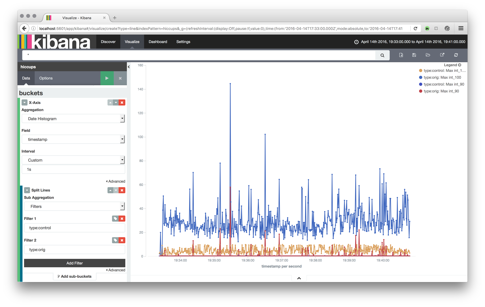

# hiccup2es

`hiccup2es` is a utility that imports jHiccup CSV log files into Elasticsearch so they can be analyzed with Kibana. 

## Prerequisites

`hiccup2es` requires Python 3.4+ available as `python3` on the path (verify with: ``python3 --version``). Also you need to have access to an Elasticsearch cluster.

## Installation

Just clone the repo:
 
```
git clone https://github.com/danielmitterdorfer/hiccup2es.git
```

`hiccup2es` has no additional dependencies except Python 3. If you use https and want to verify SSL certificates you can install certifi with `pip3 install certifi`.

## Usage / Workflow

1. Create a hiccup log. Currently, the only tested configuration is `export _JAVA_OPTIONS='-javaagent:PATH_TO_JHICCUP/jHiccup.jar="-d 0 -i 1000 -l hiccuplog -c"'`.
2. Convert the hiccup log to CSV with `jHiccupLogProcessor`, e.g. `./jHiccupLogProcessor -i hiccuplog -o hiccuplog-plain`
3. Import the file into Elasticsearch with `python3 hiccup2es.py --input-file=hiccuplog-plain --create-index`. Note: This is assuming that Elasticsearch is running on localhost in its default configuration. See `python3 hiccup2es.py --help` for further options.  
4. Create a visualization in Kibana and enjoy:



## License

`hiccup2es` is distributed under the terms of the [Apache Software Foundation license, version 2.0](LICENSE).